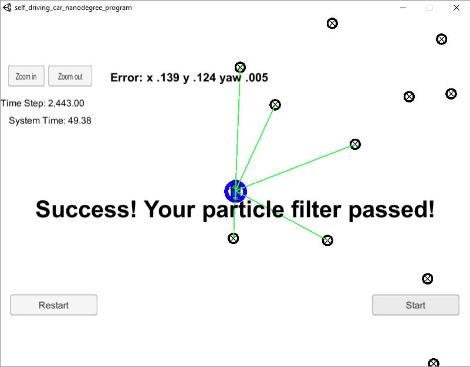

**Particle Filter**
---

**Particle Filter Project**

The goals of this project are the following:

* Implement the Particle filter algorithm
* Run the implemented algorithm on the simulator
* Summarize the results with a written report

## Project Basics
In this project, I used C++ to write a program taking a map and sensor data to know the position of a kidnapped vehicle using Particle Filters.

See files in the 'src' folder for the primary C++ files making up this project.
---
### The results

| parameter |   error   |
| ----- | ------- |
|  x   | 0.139 |
|  y   | 0.124 |
|  theta   | 0.005 |

